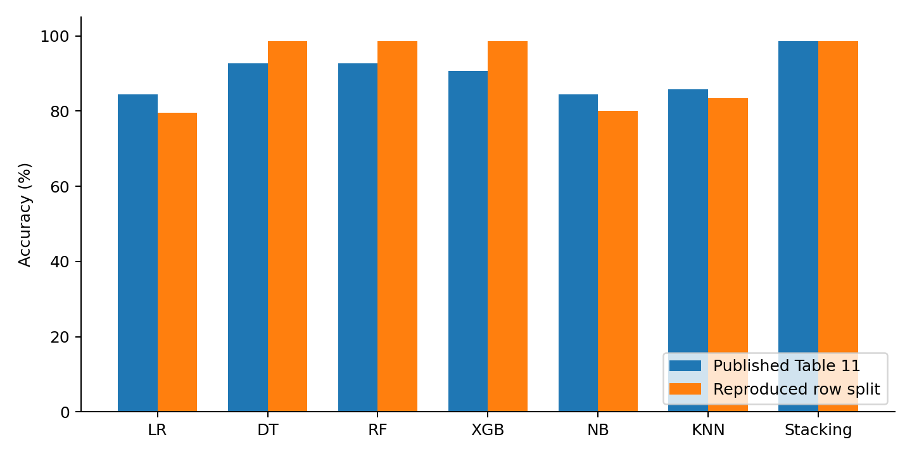
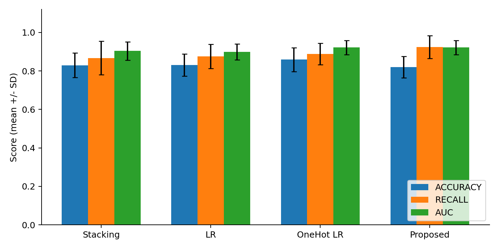
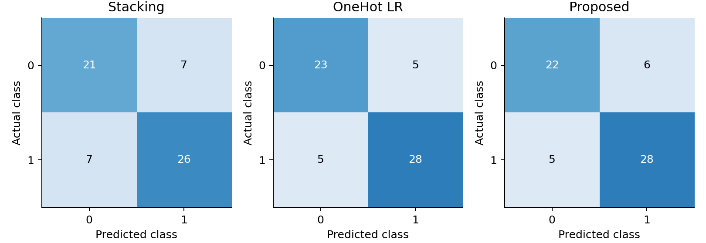
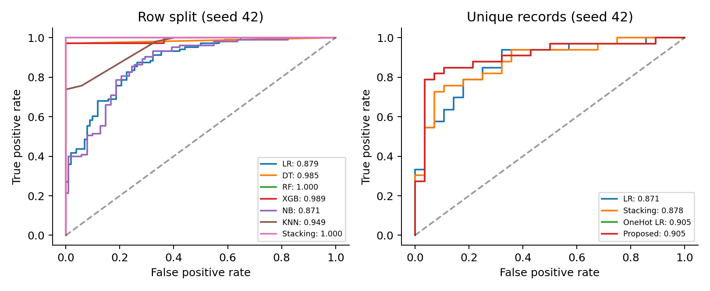

# SIT720 Machine Learning Mini Research
## Reproducing a stacking model and testing a simpler alternative

Student name: Alex Thomas

Student ID: 225706598

Selected paper: M. Bhagat, A. Sharma and P. Agarwal, "An efficient stacking-based ensemble technique for early heart attack prediction," Multimedia Tools and Applications, vol. 84, pp. 36351-36375, 2025; first published online in 2024. DOI: 10.1007/s11042-024-19293-7 [1].

Video presentation: ________________________________________________

GitHub repository: https://github.com/iamalexthomas/sit720-heart-disease-study

## Abstract

This study reproduces six classifiers and a stacking model from paper option 3. It uses the paper's linked dataset, all 13 input features and an inferred 80/20 split. Missing implementation details are documented as assumptions. The reproduced stack achieves 98.54% accuracy, close to the paper's 98.53%. However, 199 of 205 test rows have an identical record in training. There are only 302 distinct records among 1,025 rows. A second experiment removes duplicate records and evaluates all methods on ten shared train/test splits. The proposed method uses one-hot encoding, logistic regression and a threshold chosen using training folds. It achieves 92.42% mean recall and 0.9221 mean AUC, compared with 86.67% and 0.9039 for stacking. Its accuracy is slightly lower. The main finding is that careful data preparation and a simple model can be useful, but no method is best on every measure.

## 1 Research problem and paper selection

This paper was selected because it uses a small tabular dataset and standard classification methods. The models and proposed changes can be implemented using pandas and scikit-learn, with XGBoost for one of the baselines.

The selected paper aims to classify heart disease from recorded measurements. Its motivation is to support earlier detection. The gap it addresses is that individual classifiers may make different errors, so combining them could improve predictions. Its contribution is a stack of logistic regression (LR), decision tree (DT), random forest (RF), XGBoost (XGB), Naive Bayes (NB) and K-nearest neighbours (KNN).

The paper's review covers hybrid models and feature selection as state-of-the-art approaches in its literature context. It reports 88.47% accuracy for the hybrid RF/linear method of Mohan et al., 92.37% for the FCMIM-SVM method of Li et al., and 85.48% for the voting ensemble of Latha and Jeeva [1, Table 14]. These are secondary summaries from the chosen paper, not experiments repeated here or a claim about the latest state of the field. Different datasets and splits prevent a fair ranking from these figures alone.

<!-- pagebreak -->

## 2 Dataset and features

The included heart.csv was downloaded directly from the Kaggle dataset linked in the paper [2]. It contains 1,025 rows and 14 columns: 13 predictors plus target. The target is never used as an input. The CSV's category and target codes are kept unchanged. The paper describes target=1 as disease; this report uses class 1 as the positive class for numerical comparability. Its clinical meaning is not independently verified from patient records.

The original UCI documentation describes diagnosed disease, rather than a time-to-future-heart-attack outcome [3]. It also uses some different category codes. Therefore, the experiment should be understood as classification of the supplied labels, not proof of early heart attack prediction. The paper describes four source databases, but this CSV has no hospital or patient ID to verify that provenance or patient independence.

| Predictor | Meaning / treatment |
| --- | --- |
| age | Age in years; continuous |
| sex | Recorded sex code; category |
| cp | Chest pain type; category |
| trestbps | Resting blood pressure; continuous |
| chol | Serum cholesterol; continuous |
| fbs | Fasting blood sugar indicator; category |
| restecg | Resting ECG result; category |
| thalach | Maximum heart rate; continuous |
| exang | Exercise-induced angina indicator; category |
| oldpeak | ST depression; continuous |
| slope | Exercise ST segment slope; category |
| ca | Number of vessels code; treated as a discrete category in Part 2 |
| thal | Thal test code; category |

Table 1. Input features. The proposed model expands category codes into binary columns; it does not add new source measurements.

## 2.1 Data checks

| Check | Observed result |
| --- | --- |
| Raw class counts | 499 class 0; 526 class 1 |
| Distinct record counts | 138 class 0; 164 class 1; 302 total |
| Extra exact duplicate rows | 723 of 1,025 (70.54%) |
| Blank / NaN cells | 0 |
| Identical predictors with conflicting labels | 0 |
| Codes outside paper Table 9 ranges | ca=4 in 18 rows; thal=0 in 7 rows |
| Original split overlap | 199 / 205 test rows match a training record |
| Duplicate-free split overlap | 0 / 61 test rows, in every split |

Table 2. Counts measured from the included CSV. Unusual codes are retained, because their meaning is uncertain. No records are removed as outliers.

Duplicate removal keeps the first row for each identical set of 13 predictors, after checking labels agree. The original CSV remains unchanged. A distinct feature record is not necessarily a distinct patient. The duplicate check reduces an observed problem but cannot establish patient independence without identifiers.

<!-- pagebreak -->

## 3 Part 1 reproduction method

The study follows the available description in [1], including all six classifiers and their five-fold stack. It is a reproduction under explicit assumptions, not an exact recreation of unavailable author code. The paper's feature-importance plot does not define a selected subset, so all 13 predictors are retained.

| Item | Paper description and implementation decision |
| --- | --- |
| Outer split | The figures contain 205 test observations. With 1,025 rows this implies 80/20. Use 820 training and 205 test rows. |
| Randomness | Seed and stratification are unspecified. Use shuffled, unstratified seed 42; no seed search. |
| Preprocessing | The paper mentions normalisation and category encoding, without an exact recipe. Retain numeric category codes and standardise all 13 columns. |
| Missing values | The paper describes linear-regression imputation. This CSV has no NaNs, so no imputation is applied. Unknown special codes are not guessed to be missing. |
| Training boundaries | Fit scalers only on training data. For stacking, each scaler is inside its base learner pipeline, so it is refit inside each fold. |
| Stacking | Use all six base models, five shuffled stratified folds, and class-1 probabilities. LR is the assumed final classifier; original features are not passed to it. |
| Decision rule | Class 1 if probability is at least 0.5. The paper does not specify its threshold or tie rule. |

Table 3. Decisions where the paper leaves details unclear. Its workflow diagram and algorithm differ about preprocessing order; training-only fitting avoids exposing test information [4].

## 3.1 Fixed classifier settings

| Model | Settings used |
| --- | --- |
| LR | L2 regularisation, C=1, lbfgs solver, max_iter=2000 |
| DT | Entropy criterion, unlimited depth, min_samples_split=2, min_samples_leaf=1 |
| RF | 100 trees, Gini criterion, sqrt features, unlimited depth, bootstrap sampling |
| XGB | 100 trees, depth=6, learning_rate=0.3, subsample=1, colsample_bytree=1, lambda=1, histogram tree method |
| NB | Gaussian NB; var_smoothing=1e-9 |
| KNN | 5 neighbours, uniform weights, Euclidean distance |
| Stacking | The six pipelines above; LR final model with C=1; 5-fold out-of-fold probabilities |

Table 4. DT entropy follows the paper's algorithm. Other concrete parameter choices are assumptions because the paper gives no parameter table. Remaining values use the pinned package defaults. Random states are fixed and parallel fitting is disabled.

Stacking first trains base models on four folds and predicts the held-out fifth fold. Repeating this gives training predictions for the final LR model. The base learners are then refitted on all outer training data [5]. The final test set is used only for evaluation. Repeated records remain a weakness of the Part 1 protocol, including within its stacking folds.

<!-- pagebreak -->

## 4 Part 1 results and comparison

| Model | Source | Accuracy | Precision | Recall | F1 | AUC |
| --- | --- | --- | --- | --- | --- | --- |
| LR | Paper | 0.8439 | 0.8196 | 0.9090 | 0.8620 | 0.9204 |
| LR | This study | 0.7951 | 0.7563 | 0.8738 | 0.8108 | 0.8787 |
| DT | Paper | 0.9268 | 0.9702 | 0.8909 | 0.9289 | 0.9702 |
| DT | This study | 0.9854 | 1.0000 | 0.9709 | 0.9852 | 0.9854 |
| RF | Paper | 0.9268 | 0.9130 | 0.9545 | 0.9333 | 0.9734 |
| RF | This study | 0.9854 | 1.0000 | 0.9709 | 0.9852 | 1.0000 |
| XGB | Paper | 0.9073 | 0.9174 | 0.9090 | 0.9132 | 0.9830 |
| XGB | This study | 0.9854 | 1.0000 | 0.9709 | 0.9852 | 0.9894 |
| NB | Paper | 0.8439 | 0.8250 | 0.9000 | 0.8608 | 0.9185 |
| NB | This study | 0.8000 | 0.7541 | 0.8932 | 0.8178 | 0.8706 |
| KNN | Paper | 0.8585 | 0.8648 | 0.8727 | 0.8687 | 0.9304 |
| KNN | This study | 0.8341 | 0.8000 | 0.8932 | 0.8440 | 0.9486 |
| Stacking | Paper | 0.9853 | 1.0000 | 0.9727 | 0.9861 | 0.9880 |
| Stacking | This study | 0.9854 | 1.0000 | 0.9709 | 0.9852 | 1.0000 |

Table 5. Published values are transcribed from [1, Table 11]. Reproduced values come from this study's 205-row test set. Scores are proportions; 0.9854 means 98.54%.

The stack gets 202 of 205 rows correct: 98.5366%, rounded to 98.54%. The paper reports 98.53%, and its confusion matrix also has 202 correct results. That similar accuracy does not mean the predictions or experiment are identical. Our test set contains 103 positives and 102 negatives; the paper shows 110 and 95. Our stack's recall is 0.9709 and AUC is 1.0000, whereas the paper gives 0.9727 and 0.9880. AUC can be 1 with imperfect accuracy when ranking is perfect but the 0.5 threshold makes mistakes.

DT, RF and XGB are more accurate here than in the paper; LR, NB and KNN are less accurate. Different splits, unspecified settings, category handling and software versions are plausible explanations, not measured causes. The observed overlap is a further concern: 97.07% of our test rows have a training copy. This supports concern about overly optimistic evaluation [6], but does not prove the authors used the same overlapping split.

<!-- pagebreak -->

## 5 Proposed solution

The proposed solution removes repeated records, represents categories with separate binary columns, and uses logistic regression with a threshold chosen to favour recall. These changes address data preparation, feature representation, validation and the prediction rule. Each step uses a standard library function, followed by a short loop over possible thresholds. This is a practical application of established methods to the paper's limitations, rather than a new classification algorithm.

## 5.1 Motivation and procedure

1. Remove exact duplicate records before splitting, so repeated measurements cannot appear in both sets. Leakage research explains why training/test dependence can inflate scores [6].

2. Standardise the five continuous predictors using training means and standard deviations. One-hot encode the eight discrete predictors. For example, a chest-pain code becomes a set of yes/no columns rather than an assumed numeric distance. Unseen categories are ignored by the encoder.

3. Fit L2-regularised logistic regression with C=1. Keep this setting fixed. One final classifier is easier to explain than six base learners plus a meta-classifier.

4. Within the outer training set, obtain five-fold out-of-fold probabilities. Try thresholds 0.20, 0.25, ..., 0.80 and choose the one with the highest F2. Break ties by proximity to 0.5, then by the smaller threshold. Refit on all training records and evaluate once on the outer test set. Threshold selection through internal validation follows the approach described in [7].

F2 gives more weight to recall than precision. The aim is to miss fewer class-1 records while reporting the extra false positives. It is an educational choice, not a clinically established cost ratio. The threshold is never selected from test labels. The experiment does not promise better accuracy or AUC just from changing a threshold.

## 5.2 Evaluation protocol

Ten fixed seeds, 42 through 51, give ten stratified 80/20 splits of the 302 distinct records. Each has 241 training records and 61 test records, with 33 class-1 and 28 class-0 test records. Every model uses exactly the same split for each seed. All seven Part 1 methods are retrained on these duplicate-free sets. The main comparison is against this retrained stack, because comparing a 61-record clean test directly with the published 205-row test would mix different conditions.

An ablation separates two changes: ordinary encoded LR, one-hot LR at threshold 0.5, and the full proposed method. All use the same clean splits. The plan and seeds were fixed before fitting, and no model or seed was selected using the test results. The mean and sample standard deviation describe variation across splits. Because records recur across splits, the ten results are dependent; they are not ten independent cohorts or a confidence interval.

## 5.3 Evaluation measures

Accuracy = (TP + TN) / N. Precision = TP / (TP + FP). Recall = TP / (TP + FN). F1 = 2TP / (2TP + FP + FN). Here TP means a class-1 record correctly classified as 1. ROC AUC measures the ranking of class-1 versus class-0 probabilities over thresholds. It is calculated from probabilities, not predicted class labels.

Additional measures are specificity = TN / (TN + FP), Matthews correlation coefficient (MCC), and F2 = 5TP / (5TP + 4FN + FP). All are saved with confusion-matrix counts. F2 chooses the threshold; the five task-required measures remain the main reported outcomes.

<!-- pagebreak -->

## 6 Part 2 repeated-split results

| Model | Accuracy | Precision | Recall | F1 | AUC |
| --- | --- | --- | --- | --- | --- |
| LR | 0.831 +/- 0.058 | 0.827 +/- 0.065 | 0.876 +/- 0.063 | 0.849 +/- 0.051 | 0.900 +/- 0.041 |
| DT | 0.756 +/- 0.052 | 0.794 +/- 0.046 | 0.742 +/- 0.096 | 0.764 +/- 0.059 | 0.757 +/- 0.050 |
| RF | 0.823 +/- 0.050 | 0.827 +/- 0.054 | 0.855 +/- 0.077 | 0.839 +/- 0.047 | 0.898 +/- 0.043 |
| XGB | 0.795 +/- 0.051 | 0.808 +/- 0.058 | 0.821 +/- 0.081 | 0.812 +/- 0.050 | 0.883 +/- 0.032 |
| NB | 0.815 +/- 0.067 | 0.828 +/- 0.078 | 0.836 +/- 0.073 | 0.830 +/- 0.061 | 0.889 +/- 0.054 |
| KNN | 0.808 +/- 0.050 | 0.808 +/- 0.062 | 0.855 +/- 0.037 | 0.829 +/- 0.040 | 0.866 +/- 0.052 |
| Stacking | 0.830 +/- 0.063 | 0.829 +/- 0.062 | 0.867 +/- 0.087 | 0.845 +/- 0.059 | 0.904 +/- 0.047 |
| OneHot LR | 0.859 +/- 0.062 | 0.858 +/- 0.062 | 0.888 +/- 0.055 | 0.872 +/- 0.055 | 0.922 +/- 0.037 |
| Proposed | 0.820 +/- 0.056 | 0.783 +/- 0.049 | 0.924 +/- 0.059 | 0.847 +/- 0.047 | 0.922 +/- 0.037 |

Table 6. Mean +/- sample SD over ten shared, duplicate-free splits. All cells are proportions. OneHot LR and Proposed use identical probabilities; only their thresholds differ, so their AUC is identical.

| Metric | Mean difference (points) | Wins / ties / losses |
| --- | --- | --- |
| ACCURACY | -0.98 | 3 / 1 / 6 |
| PRECISION | -4.60 | 2 / 0 / 8 |
| RECALL | +5.76 | 8 / 1 / 1 |
| F1 | +0.19 | 6 / 0 / 4 |
| AUC | +1.82 | 8 / 0 / 2 |

Table 7. Proposed minus stacking on paired splits. Differences are percentage points (100 times the score difference). Wins/ties/losses count seeds, rather than independent statistical trials.

The proposed method raises mean recall by 5.76 points and AUC by 1.82 points over the clean stack. Recall is higher on eight splits, tied on one and lower on one. Accuracy falls by 0.98 points and precision by 4.60 points. These results support a recall/precision trade-off, not overall superiority or a statistically significant benefit.

The ablation matters: one-hot LR at 0.5 has the highest mean accuracy (85.90%). It improves over ordinary LR before threshold tuning. Lowering the threshold raises mean recall from 88.79% to 92.42%, but lowers accuracy from 85.90% to 81.97%. Mean F2 rises from 0.8815 to 0.8916. Thus the simpler untuned decision rule is preferable if accuracy matters most; the full proposal serves the stated recall objective.

<!-- pagebreak -->

## 7 Example outputs and error analysis

Seed 42 is an example selected in advance, not the best-performing seed. Its proposed threshold is 0.40. Thresholds across all ten training-only searches range from 0.20 to 0.40, showing that this small dataset does not yield one stable cutoff.

| Model | Accuracy | Precision | Recall | F1 | AUC |
| --- | --- | --- | --- | --- | --- |
| Stacking | 0.7705 | 0.7879 | 0.7879 | 0.7879 | 0.8777 |
| OneHot LR | 0.8361 | 0.8485 | 0.8485 | 0.8485 | 0.9048 |
| Proposed | 0.8197 | 0.8235 | 0.8485 | 0.8358 | 0.9048 |

Table 8. Results on the same 61 distinct test records at seed 42.

The stack misses 7 class-1 records and incorrectly flags 7 class-0 records. The proposal misses 5 and incorrectly flags 6. However, one-hot LR at 0.5 also misses 5 and incorrectly flags only 5. On this split threshold tuning adds one false positive without recovering a positive. This is a concrete failure case of the proposal, even though its mean recall is higher across the ten splits.

Across splits, specificity falls from 0.7857 for stacking to 0.6964 for the proposal. Mean MCC also falls, from 0.6614 to 0.6460. These additional measures make the cost of recall improvement clear. There is no reason to describe the tuned threshold as universally better. The right-hand ROC curves for OneHot LR and Proposed overlap because thresholding does not change probability rankings.

<!-- pagebreak -->

## 8 Critical discussion

## 8.1 Problems in the published reporting

The paper's introduction reports 96.58% stacking accuracy, whereas its abstract and results tables report 98.53%. Table 11 is used consistently here as the comparison source. Some of its additional metric columns are inconsistent with the confusion matrices. For example, Figure 5 gives TN=95, FP=0, FN=3 and TP=107. These imply recall 107/110=0.9727, specificity 1.0000 and MCC about 0.9710. Table 12 instead lists sensitivity 0.9853, specificity 0.9861 and MCC 1.0000. Those values are not copied into our calculated results. This also illustrates why saved predictions are more useful than an accuracy number alone.

The exact scaler, encoder, seed, final stacking estimator, hyperparameters and selected feature subset are not fully stated. All our assumptions are listed. These omissions prevent an exact replication even when the named models and linked dataset are used. The dataset's repeated rows also mean that its 1,025 entries should not be described as 1,025 verified independent patients.

## 8.2 What the experiments support

The near-match to 98.53% on the raw split is weak evidence of generalisation because most test rows have training copies. With distinct records, the stack averages 82.95% accuracy. This decrease is consistent with overlap inflating raw performance, but it does not isolate its size: the clean experiment also changes sample size, class stratification and which rows are held out. A controlled overlap study would be needed for a causal estimate.

On the same clean splits, the proposed pipeline has better average positive-class recall and probability ranking than stacking, using one final classifier. Explicit category handling accounts for much of the improvement; threshold tuning changes the operating trade-off. This matches the distinction between learning probabilities and choosing a decision cutoff in [7]. The result does not establish superiority over the paper's published score because those protocols are different.

## 8.3 Strengths, limits and practical meaning

The strengths are a small readable implementation, all seven reproduced methods, explicit assumptions, training-only preprocessing, matched comparisons, and an ablation. The original data, exact split IDs, probabilities, metrics, software versions and executed notebook are included. The study tests a useful change without making the model unnecessarily complex.

The main limits are the 302-record sample, uncertain record provenance, lack of patient IDs, unknown special-code meanings and lack of external validation. Repeated splits reuse observations, so their SD is descriptive. One-hot encoding increases the number of columns in a small dataset, and LR may miss nonlinear relationships. The proposal's recall gains come with more false positives. The chosen F2 objective is not a measured clinical utility function. Positive-class semantics would need checking before any clinical interpretation.

No future-event date, follow-up period or external hospital cohort is available. These results therefore do not show prospective prediction of heart attacks or readiness for clinical use. Useful future work would verify labels and patient identities, obtain an independent dataset, compare calibration, and choose error costs with appropriate domain input.

## 8.4 Conclusion

The selected paper can be reproduced at the level of its described model families, but its exact experiment is underspecified. A high raw-split accuracy hides extensive record overlap. After removing duplicates, a simple category-aware LR model is competitive with stacking. Its threshold can improve class-1 recall, but that benefit has a measurable precision and specificity cost. The main lesson is to check the evaluation design before adding more models.

<!-- pagebreak -->

## 9 Reproducibility

The GitHub repository linked on the first page contains the dataset, Python source, executed notebook and saved results. Running python run_experiments.py regenerates the tables and figures. The notebook explains the steps and includes a short demonstration of the proposed model. The README gives installation and execution instructions, and tools/verify_results.py independently checks the saved metrics against the predictions.

The tested environment is Python 3.14.7, scikit-learn 1.9.1, XGBoost CPU 3.4.1, NumPy 2.4.6, pandas 2.3.3 and SciPy 1.16.2. Exact dependencies are recorded. The dataset SHA-256 is recorded in data/SOURCE.md and results/data_audit.json. The public Kaggle metadata reports version 2, last updated June 6, 2019, with licence listed as "Unknown". The separate UCI source is attributed in [3]; its licence is not silently assigned to this Kaggle copy.

## References

[1] M. Bhagat, A. Sharma, and P. Agarwal, "An efficient stacking-based ensemble technique for early heart attack prediction," Multimedia Tools and Applications, vol. 84, pp. 36351-36375, 2025, first published online Apr. 30, 2024, doi: 10.1007/s11042-024-19293-7. Supplied as HD Task paper option 3.pdf.

[2] J. Smith (johnsmith88), "Heart Disease Dataset," Kaggle, version 2, 2019. [Online]. Available: https://www.kaggle.com/datasets/johnsmith88/heart-disease-dataset. Accessed: Sep. 26, 2026.

[3] A. Janosi, W. Steinbrunn, M. Pfisterer, and R. Detrano, "Heart Disease," UCI Machine Learning Repository, 1988, doi: 10.24432/C52P4X. [Online]. Available: https://archive.ics.uci.edu/dataset/45/heart+disease. Accessed: Sep. 26, 2026.

[4] Scikit-learn developers, "Common pitfalls and recommended practices," scikit-learn documentation. [Online]. Available: https://scikit-learn.org/stable/common_pitfalls.html. Accessed: Sep. 26, 2026.

[5] Scikit-learn developers, "StackingClassifier," scikit-learn documentation. [Online]. Available: https://scikit-learn.org/stable/modules/generated/sklearn.ensemble.StackingClassifier.html. Accessed: Sep. 26, 2026.

[6] S. Kapoor and A. Narayanan, "Leakage and the reproducibility crisis in machine-learning-based science," Patterns, vol. 4, no. 9, Art. no. 100804, 2023, doi: 10.1016/j.patter.2023.100804.

[7] Scikit-learn developers, "Tuning the decision threshold for class prediction," scikit-learn documentation. [Online]. Available: https://scikit-learn.org/stable/modules/classification_threshold.html. Accessed: Sep. 26, 2026.
